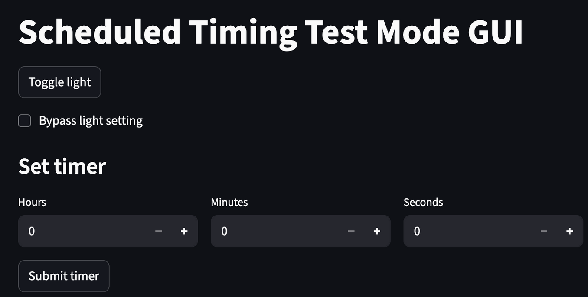
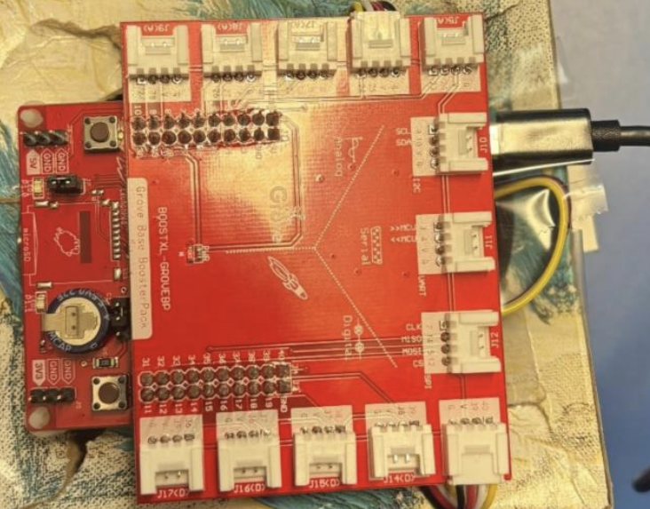

# Scheduled Timing Prototype Web App for ENGR 13100 @ Purdue

## Important Links & Info
- [TiKit Board Information](https://engineering.purdue.edu/fye_tikit/)
  - The MSP-EXP430FR5994 board found in the TiKits will be referred to as "TiKit Board."
- [PyPI Page](https://pypi.org/project/ti_kit_board_communication/)

## This project creates a web app using the streamlit Python library to interact with the TiKit board visually.

The goal of this project was to create a web app for users to interact with the TiKit Board. The web app, built with the `streamlit` Python library, allows users to turn the TiKit Board's built-in LED on and off. Users can also set timers with a maximum time limit of one day. The timer is displayed on the four-digit display. After the timers have completed, a sound will play, and the TiKit Board's built-in LED will turn on. 

The `pyserial` Python library was used to establish a connection between the TiKit Board and the connected computer. This project works by sending and receiving messages over the established serial port connection.

## How to install this library

1. Install the Python library:
  - `pip install ti_kit_board_communication`
2. Import the Python library in your code:
  - `from ti_kit_board_communication.main import TiKitBoard`
3. Read the project docs here:
  - [Docs](https://vg-fish.github.io/Scheduled-Timing-App-ENGR-131/ti_kit_board_communication/main.html)


## Example Usage: Scehduled Timing Prototype

_Check out `example/ui.py` in this Github repo to see some example usage._

### Goal:
The goal of the scheduled timing prototype was to create a timer-based intelligent lighting system that combines sunlight sensing with automated LED supplementation. The web app and TiKit Board are shown below.

### Key points:

1. Created the `TiKitBoard` object using:
```python 
st.session_state.board = TiKitBoard(port="/dev/cu.usbmodem1103")
st.session_state.board.connect_with_retries()
```
2. Turned the board's LED on and off using:
```python
if st.session_state.light_state:
    board.send_message(b"light_on")
else:
    board.send_message(b"light_off")
```
3. Saved the time remaining on the timer using:
```python
board.write_key_to_storage("timer_length", int(value))
```
4. Updated the UI and checked the serial connection every second using:
```python
@st.fragment(run_every="1s")
```
  - _Change `"1s"` to something quicker if you want the UI or serial connection to be checked more frequently._
5. Use the following code to send information to the computer in the `loop()` or `setup()` function:
```c
Serial.write("<YOUR_STRING><YOUR_ENDING_CHARCTER>");
```
 - _Your ending character should be the same on the board and computer side. Use the `special_ending_character` parameter
 in the `TiKitBoard()` constructor to change the default ending charcter._

### Images



*Web app*



*TiKit Board*
